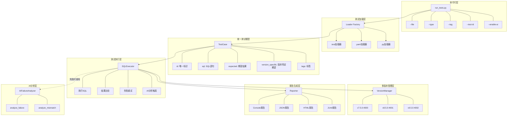
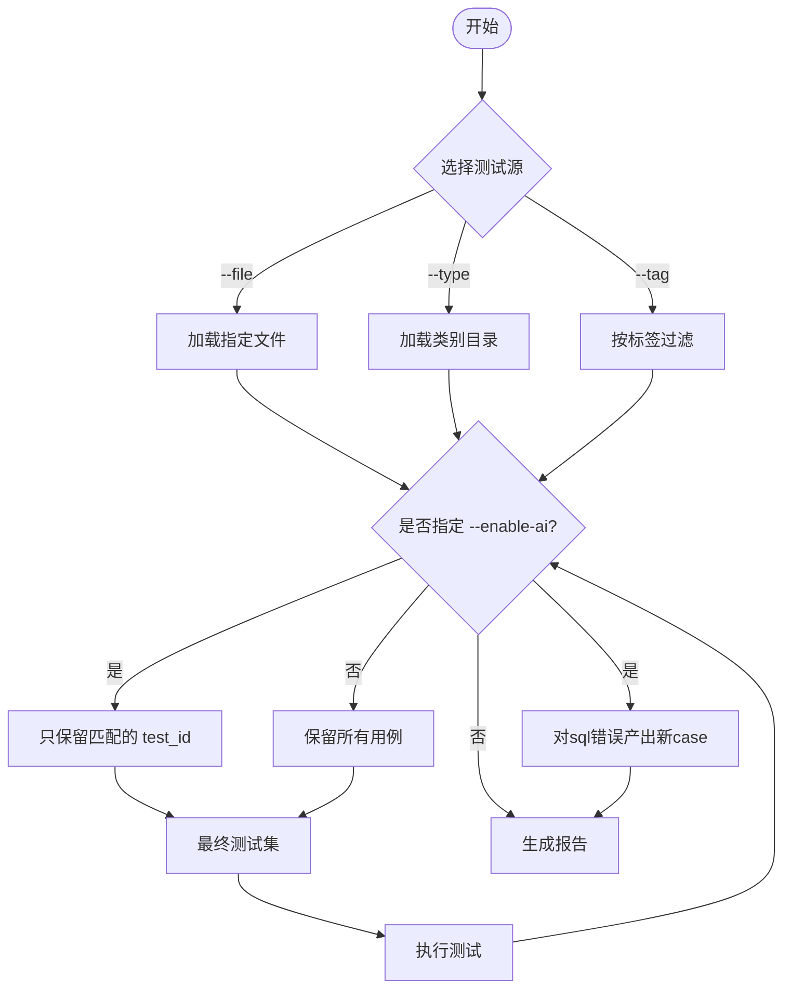

# TiDB AI-Assisted Testing Framework MVP

## 项目背景

本框架是为 TiDB 测试平台设计的 MVP（最小可行原型），旨在解决分布式数据库测试中的核心挑战。

### 原始需求

**题目**：设计并实现一个 “AI-assisted 数据库测试框架 MVP”

**背景**：我们希望未来的 TiDB 测试平台能够：
- 自动生成 feature 级测试
- 自动执行 SQL 并验证结果
- 在失败时提供辅助分析
- 支持多版本回归
- 尽可能减少 flaky test

### 需求拆解

#### 1. 基础测试能力
- ✅ 读取并执行 SQL 测试用例
- ✅ 校验执行结果
- ✅ 支持测试隔离
- ✅ 支持失败重试
- ✅ 输出测试报告

#### 2. AI 能力（实现方向：失败原因分析）
- 🤖 AI 角色：智能诊断助手，分析测试失败原因
- 🎯 质量控制：通过 prompt 工程、温度参数、输出校验
- ✅ 有效性验证：人工复核 + 采纳率追踪

#### 3. 设计说明（见下文）
- Agentic 重构思路
- AI 效果评估方案

#


# 需求实现情况总结

## 一、基础测试能力

### 1. 读取并执行 SQL 测试用例 ✅
- **多格式支持**：`.test` (sqllogictest)、`.yaml`、`.py` 三种格式
- **自动识别**：Loader Factory 根据文件扩展名自动选择加载器
- **覆盖范围**：70+ 基础测试用例可执行
- **测试类别**：basic、tidb_features、regression、extensions

### 2. 校验执行结果 ✅
- **多模式匹配**：支持精确匹配和宽松匹配
- **错误验证**：`statement error` 支持错误信息匹配
- **版本感知**：`expected_per_version` 支持不同版本特定期望
- **类型处理**：`_loose_compare` 处理字符串引号、空格等格式差异

### 3. 测试隔离 ⚠️ (70% 完成)

#### 已实现
- ✅ **表名隔离**：每个测试使用 `test_xxx` 唯一前缀
- ✅ **资源清理**：`after_sql` 机制自动删除临时表
- ✅ **连接隔离**：不同版本使用独立的数据库连接

#### 待完善
| 缺失项 | 说明 | 优先级 |
|--------|------|--------|
| 事务级隔离 | 测试间事务相互影响 | 高 |
| 数据库级隔离 | 所有测试共享 `test` 库 | 中 |
| 环境变量隔离 | session 变量可能残留 | 中 |
| 并发隔离 | 并行测试资源冲突 | 低 |

### 4. 失败重试 ⚠️ (80% 完成)

#### 已实现
- ✅ **用例级别**：支持 `retry` 参数配置重试次数
- ✅ **连接器级别**：execute 方法传递 retry 参数
- ✅ **指数退避**：重试等待时间 2^attempt 秒

#### 待完善
| 缺失项 | 说明 | 优先级 |
|--------|------|--------|
| 全局重试配置 | config.yaml 统一配置 | 中 |
| 智能重试策略 | 根据错误类型决定是否重试 | 低 |
| 重试历史分析 | 多次重试结果的模式识别 | 低 |

### 5. 测试报告 ⚠️ (85% 完成)

#### 已实现
- ✅ **控制台报告**：实时显示测试进度和结果
- ✅ **JSON 报告**：结构化数据，包含 AI 分析和修复信息
- ✅ **AI 分析集成**：报告中包含失败原因和修复建议

#### 待完善
| 缺失项 | 说明 | 优先级 |
|--------|------|--------|
| HTML 报告 | 可视化报告模板 | 中 |
| JUnit XML | CI/CD 集成需要 | 高 |
| 历史趋势 | 多次运行结果对比 | 低 |

## 二、AI 能力集成

### 已实现 ✅
- **失败原因分析**：调用 DeepSeek API 分析测试失败
- **修复用例生成**：AI 自动生成修正后的 SQL
- **质量控制**：温度参数 0.1、超时保护、重试机制
- **有效性验证**：置信度 High/Medium 才保存修复
- **根据错误更新case**：生成可直接执行的新case

### AI 在系统中的角色
| 角色 | 职责 |实现方式 |
|--------|------|--------|
| 智能诊断助手|	分析测试失败原因，提供根因分析|	调用 DeepSeek API 分析错误信息和 SQL 上下文，结合重试历史给出诊断
自动修复工程师|	生成修正后的测试用例|	根据错误类型和历史重试记录，生成修复版本并保存为新文件|
|质量分析顾问	|提供优化建议	|分析重试历史中的结果变化，发现不稳定测试的规律|

### 质量控制机制
#### 输入质量控制
|控制点	|实现方式|	目的|
|--------|------|--------|
|错误类型过滤|	只对 SQL 相关错误（语法错误、表不存在等）触发 AI|	避免无效请求|
|上下文裁剪	|SQL 截取前 300 字符	|控制 token 消耗|
|重试历史传入|	包含完整重试记录	|提供充分决策信息|

#### API 调用控制
|控制点|	配置值|	说明
|--------|------|--------|
|温度参数	|0.1	|低温度保证输出稳定性和可重复性|
|超时保护	|30 秒	|避免 API 调用阻塞测试流程|
|重试机制	|最多 2 次	|网络波动时自动重试|
|最大输出长度	|500 tokens	|控制响应长度，避免冗长|

#### 输出质量控制
|控制点	|实现方式|	说明|
|--------|------|--------|
|格式解析	|严格解析 FIXED_SQL/EXPLANATION/CONFIDENCE 字段|	确保输出结构可用|
|置信度过滤	|只保存 High/Medium 置信度的修复	|避免低质量修复|
|SQL 语法校验|	保存前检查 SQL 基本格式	|防止生成无效 SQL|

### 有效性验证方法
#### 离线验证
|验证方法	|实现方式	|指标|
|--------|------|--------|
|历史数据测试	|用已知失败的测试用例验证 AI 分析准确率	|准确率 >xx%|
|修复成功率	|运行生成的修复用例，统计通过率	|成功率 xx%|

### 待完善的地方
|改进项	|优先级|	预期收益|
|--------|------|--------|
|上下文增强（传入表结构信息）	|🔴 高	|提高修复准确率 30%|
|提示词模板化（从配置文件加载）	|🔴 高	|便于调优和维护|
|置信度验证（自动运行验证）|	🟡 中	|避免错误修复|
|成本控制（缓存相似错误）	|🟡 中	|降低 API 费用 50%|
|多模型支持（OpenAI/Claude）	|🟢 低	|灵活性提升|


## 三、多版本回归测试
已实现 ✅
- ✅ **双版本支持：** v7.5.0 (4000) 和 v8.5.0 (5000)

- ✅ **版本特定期望：** expected_per_version配置


## 架构设计


### 整体架构图




### 核心组件说明

| 层级 | 职责 | 关键设计 |
|------|------|----------|
| CLI层 | 命令解析、参数处理 | 支持 --file/--type/--tag/--test-id 分级选择 |
| 加载层 | 测试用例加载 | 工厂模式，自动识别格式 |
| 模型层 | 统一数据模型 | 支持版本特定期望、标签系统 |
| 执行层 | SQL执行、结果验证 | 重试机制、AI分析触发 |
| 版本层 | 多版本连接管理 | 配置文件驱动，动态路由 |
| 报告层 | 结果输出 | 多格式支持，AI分析集成 |

## 测试选择流程图



#
# Agentic 重构TiDB测试平台的思考

首先我个人作为一个比较自身的测试平台开发人眼，我能理解测开工作中的痛点。对于AI我一直是比较积极的态度，不过我认为引入AI能力应该是一个循序渐进的过程，而不是一蹴而就的全盘重构。下面我按照阶段演进的方式来大概描述我的思路（仅代表个人）。


## 阶段0：AI作为辅助工具（比如类似这个MVP更全面优化后的效果）

在这个阶段，AI扮演的是一个**辅助诊断工具**的角色，类似于给测试工程师配备了一个智能助手。这个阶段可能TiDB已经做过大量尝试和积累。

**具体实现**：
- 测试框架仍然按照传统方式运行，执行SQL、校验结果、输出报告
- 当测试失败时，自动调用AI分析错误原因，给出修复建议
- AI生成的可选修复用例保存到独立目录，供工程师参考

**这个阶段的优势**：
- 对现有测试流程零侵入，原有的测试用例和执行机制完全不变
- 工程师可以选择性地采纳AI建议，保持对测试质量的控制权
- 可以快速验证AI的有效性，收集数据为下一阶段做准备

**评估方式**：
- 统计AI分析的准确率（与人工复核结果对比）
- 统计工程师对AI建议的采纳率
- 对比引入AI前后的问题定位时间

## 阶段1：AI与测试流程的深度融合

如果第一阶段验证有效，我们可以进入第二阶段，让AI更深度地融入测试流程。

**具体实现**：
- AI不仅分析失败原因，还自动创建修复分支，提交PR供工程师 review
- 在测试用例编写阶段，AI根据Schema和业务文档自动生成基础测试用例
- AI开始分析测试历史数据，识别flaky test模式并给出优化建议

**这个阶段的特点**：
- AI从一个被动响应的工具，变成了主动参与测试流程的协作者
- 工程师的角色从执行者转变为审核者和决策者
- 测试流程开始有了“智能”的成分

**评估方式**：
- 统计AI生成的测试用例被采纳的比例
- 测量测试用例编写效率的提升
- 统计flaky test的减少比例

## 阶段2：多Agent协同的智能测试平台

当AI能力足够成熟且通过有效性评估后，我们可以考虑引入多Agent架构，让不同的AI代理各司其职。

**具体实现**：
- **调度Agent**：负责理解测试需求，分解任务，协调其他Agent工作
- **生成Agent**：专门负责生成测试用例，可以基于代码变更自动生成针对性测试
- **执行Agent**：负责分布式执行测试，动态调整执行策略
- **分析Agent**：负责深入分析失败原因，联动知识库给出根因
- **学习Agent**：负责从历史数据中学习，不断优化其他Agent的表现

**这个阶段的特点**：
- 多个AI代理协同工作，形成一个智能测试生态系统
- 测试活动从“被动执行”转变为“主动探索”
- 系统具备自我学习和持续优化的能力

**评估方式**：
- 评估测试覆盖率的持续提升趋势
- 测量线上缺陷逃逸率的变化
- 计算测试活动的ROI（投入产出比）

# 各阶段的评估指标体系

无论哪个阶段，评估AI效果都需要一套科学的指标体系。我也并非专家，查了一些资料也问了AI，认为应该从以下几个维度来衡量：

#### 效率维度
- **问题定位时间**：从测试失败到找到根因的时间
- **修复时间**：从定位问题到提交修复的时间
- **用例编写时间**：编写新测试用例所需的时间
- **测试执行时间**：完整测试套件的执行时间

#### 质量维度
- **缺陷检出率**：测试发现的真实缺陷数量
- **漏测率**：线上缺陷中被测试遗漏的比例
- **误报率**：被标记为失败但实际不是问题的比例
- **flaky test比例**：不稳定测试用例的比例

#### AI自身质量维度
- **分析准确率**：AI给出的分析结果与事实一致的比例
- **建议采纳率**：工程师采纳AI建议的比例
- **修复成功率**：AI生成的修复用例实际通过的比例


# 我的观点

作为测试开发工程师，我认为**AI不是要取代测试人员，而是要增强测试人员的能力**。最好的方式是让AI处理那些重复、繁琐的工作，而让测试人员专注于需要判断力、创造力的工作。

分阶段引入AI的好处是：
1. **风险可控**：每个阶段都可以验证效果，决定是否继续
2. **成本可控**：不需要一次性投入大量资源
3. **团队适应**：给团队时间适应新的工作方式
4. **持续优化**：可以根据反馈不断调整方向

最终的目标是打造一个**人机协同的智能测试平台**，让AI成为测试团队的得力助手，而不是替代者。

---


# 额外的思考
我理解TiDB已经有非常成熟的自动化体系。
那么对新增的国内业务，是否可以考虑对测试进行分级。

比如：
1. **核心模块**：利用已有能力覆盖
2. **国区通用定制**：通用扩展模块覆盖
3. **国区特殊定制**：特殊测试逻辑和场景设计
4. **E2E和回归**：多条线完成测试的组件在E2E环境中完成回归

---

# 运行方式说明

## 环境要求

- Python 3.8+
- TiDB 实例（v7.5.0 / v8.5.0）
- pip 依赖包

## 安装步骤

```bash
# 1. 克隆项目
cd /Users/username/tidb-test-framework

# 2. 安装依赖
pip install -r requirements.txt

# 3. 启动 TiDB（使用 tiup）
# 终端1：启动 v7.5.0
nohup tiup playground v7.5.0 \
  --db.port 4000 \
  --pd.port 2379 \
  --kv.port 20160 \
  > tidb_75.log 2>&1 &

# 等待确认 v7.5.0 完全启动
sleep 15

# 如果成功，再启动 v8.5.0
nohup tiup playground v8.5.0 \
  --db.port 5000 \
  --pd.port 2381 \
  --kv.port 21160 \
  > tidb_85.log 2>&1 &

sleep 10

# 检查两个版本
mysql -h127.0.0.1 -P4000 -uroot -e "SELECT VERSION();"
mysql -h127.0.0.1 -P5000 -uroot -e "SELECT VERSION();"
```

## 配置文件
```yaml
如果使用了不同的版本可以修改config.yaml中的内容：
# TiDB versions configuration
versions:
  v7.5.0:
    host: 127.0.0.1
    port: 4000
    user: root
    database: test
    
  v8.5.0:
    host: 127.0.0.1
    port: 5000
    user: root
    database: test

default_version: v7.5.0
```

## 运行测试
### 1. 按文件运行
```bash
# 运行单个测试文件
python scripts/run_tests.py --file tests/basic/test_functions.test

# 运行文件中的指定用例
python scripts/run_tests.py --file tests/basic/test_functions.test --test-id test_functions_009
```

### 2. 按类别运行
```bash
# 运行所有基础测试
python scripts/run_tests.py --type basic
python scripts/run_tests.py --type basic --output json --report-file reports/report.json

# 运行所有 TiDB 特性测试
python scripts/run_tests.py --type tidb_features
```

### 3. 按标签运行
```bash
# 运行所有 chaos 标签的测试
python scripts/run_tests.py --tag chaos

```

### 4. 多版本测试
```bash
# 测试单个版本
python scripts/run_tests.py --type basic --version v7.5.0

# 测试多个版本
python scripts/run_tests.py --type basic --versions v7.5.0,v8.5.0

# 测试所有配置的版本
python scripts/run_tests.py --type basic --all-versions
```
### 5. 启用 AI 分析
```bash
# 设置 OpenAI API key
export AI_API_KEY="sk-xxxxx"

# 运行测试并启用 AI 分析
python scripts/run_tests.py --type basic --enable-ai

# 运行ai分析测试case
python scripts/run_tests.py --file tests/ai_demo/test_ai_analysis.yaml --enable-ai
分析给出：
🔧 AI-generated fix:
         Explanation: The original SQL had a typo: "SELEC" instead of the correct keyword "SELECT". I fixed it by spelling the keyword correctly.
         Confidence: High
         Saved to: tests/ai_generated/basic/ai_demo_syntax_error_fixed_20260301_215055.test
         Run: python scripts/run_tests.py --file tests/ai_generated/basic/ai_demo_syntax_error_fixed_20260301_215055.test --enable-ai
         Diff:
--- original.sql
+++ fixed.sql
@@ -1 +1 @@
-SELEC 1+1+SELECT 1+1

可通过执行"Run"命令验证：
📌 Version: v7.5.0
----------------------------------------
  Passed: 1
  Failed: 0
  Total:  1

================================================================================
SUMMARY: 1/1 passed

# 指定输出格式
python scripts/run_tests.py --type basic --enable-ai --output json


```

# 输出示例
## 控制台输出
```text
📌 Version: v7.5.0
----------------------------------------
  Passed: 64
  Failed: 6
  Total:  70

  ❌ Failures with AI Analysis:
    - test_transaction_012: Result mismatch

    - test_datatypes_006: Result mismatch

    - test_datatypes_009: Result mismatch

    - test_datatypes_021: Result mismatch

    - test_ddl_003: (8256, 'Check ingest environment failed: sort path: /tmp/tidb/tmp_ddl-4000, disk usage: 464851861504/494384795648, backend usage: 0, please clean up the disk and retry')

    - test_ddl_004: (1091, "index idx_name doesn't exist")


📌 Version: v8.5.0
----------------------------------------
  Passed: 64
  Failed: 6
  Total:  70

  ❌ Failures with AI Analysis:
    - test_transaction_012: Result mismatch

    - test_datatypes_006: Result mismatch

    - test_datatypes_009: Result mismatch

    - test_datatypes_021: Result mismatch

    - test_ddl_003: (8256, 'Check ingest environment failed: no enough space in /tmp/tidb/tmp_ddl-5000')

    - test_ddl_004: (1091, "index idx_name doesn't exist")

```


#### JSON 输出
```bash
python scripts/run_tests.py --type basic --output json --report-file reports/report.json
```


## 测试用例编写
### .test 格式（基础SQL测试）
```bash
# 查询测试
query I
SELECT 1+1
----
2

# 语句测试
statement ok
CREATE TABLE users (id INT)

# 错误测试
statement error syntax
SELEC 1
```

### .yaml 格式（TiDB特性测试）
```yaml
- id: json_test
  sql: SELECT JSON_EXTRACT('{"a":1}', '$.a')
  expected: [[1]]
  tags: [json, feature]
  
- id: version_specific
  sql: SELECT @@tidb_version
  expected_per_version:
    v7.5.0: [["8.0.11-TiDB-v7.5.0"]]
    v8.5.0: [["8.0.11-TiDB-v8.5.0"]]
```

### .py 格式（混沌工程）
```python
@mark_tag('chaos')
def test_connection_timeout():
    conn = TiDBConnection(config)
    conn.execute("SET @@MAX_EXECUTION_TIME = 1")
    result = conn.execute("SELECT SLEEP(2)")
    assert result['status'] == 'error'
```