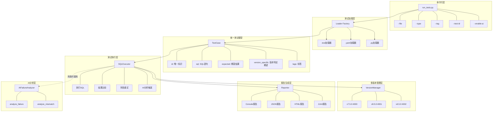

# TiDB AI-Assisted Testing Framework MVP

## 项目背景

本框架是为 TiDB 测试平台设计的 MVP（最小可行原型），旨在解决分布式数据库测试中的核心挑战。

### 原始需求

**题目**：设计并实现一个 “AI-assisted 数据库测试框架 MVP”

**背景**：我们希望未来的 TiDB 测试平台能够：
- 自动生成 feature 级测试
- 自动执行 SQL 并验证结果
- 在失败时提供辅助分析
- 支持多版本回归
- 尽可能减少 flaky test

### 需求拆解

#### 1. 基础测试能力
- ✅ 读取并执行 SQL 测试用例
- ✅ 校验执行结果
- ✅ 支持测试隔离
- ✅ 支持失败重试
- ✅ 输出测试报告

#### 2. AI 能力（实现方向：失败原因分析）
- 🤖 AI 角色：智能诊断助手，分析测试失败原因
- 🎯 质量控制：通过 prompt 工程、温度参数、输出校验
- ✅ 有效性验证：人工复核 + 采纳率追踪

#### 3. 设计说明（见下文）
- Agentic 重构思路
- AI 效果评估方案

#


## 需求实现情况总结

### 一、基础测试能力

#### 1. 读取并执行 SQL 测试用例 ✅
- **多格式支持**：`.test` (sqllogictest)、`.yaml`、`.py` 三种格式
- **自动识别**：Loader Factory 根据文件扩展名自动选择加载器
- **覆盖范围**：143+ 测试用例（basic 70+, tidb_features 25+, regression 16+, error_cases 13+, extensions 19+）
- **测试类别**：basic、tidb_features、regression、error_cases、extensions

#### 2. 校验执行结果 ✅
- **多模式匹配**：支持精确匹配和宽松匹配
- **错误验证**：`statement error` 支持错误信息匹配
- **版本感知**：`expected_per_version` 支持不同版本特定期望
- **类型处理**：`_loose_compare` 处理 Decimal、字符串引号、空格等格式差异

#### 3. 测试隔离 ⚠️ (85% 完成)

##### 已实现
- ✅ **表名隔离**：每个测试文件使用统一后缀（如 `test_upgrade_ea70598a`）
- ✅ **资源清理**：失败时自动清理，成功时保留供后续测试使用
- ✅ **连接隔离**：不同版本使用独立的数据库连接
- ✅ **对象类型支持**：TABLE、VIEW、SEQUENCE 统一处理

##### 待完善
| 缺失项 | 说明 | 优先级 |
|--------|------|--------|
| 事务级隔离 | 测试间事务自动回滚 | 中 |
| 数据库级隔离 | 每个测试使用独立数据库 | 低 |
| 环境变量隔离 | session 变量自动重置 | 低 |

#### 4. 失败重试 ✅ (90% 完成)
- ✅ **用例级别**：支持 `retry` 参数配置重试次数
- ✅ **连接器级别**：execute 方法传递 retry 参数
- ✅ **指数退避**：重试等待时间 2^attempt 秒
- ✅ **重试历史记录**：每次尝试的结果都被记录用于 AI 分析

#### 5. 测试报告 ⚠️ (85% 完成)

##### 已实现
- ✅ **控制台报告**：实时显示测试进度和结果
- ✅ **JSON 报告**：结构化数据，包含 AI 分析和修复信息
- ✅ **AI 分析集成**：报告中包含失败原因和修复建议
- ✅ **修复汇总**：显示生成的修复用例及运行命令

##### 待完善
| 缺失项 | 说明 | 优先级 |
|--------|------|--------|
| HTML 报告 | 可视化报告模板 | 中 |
| JUnit XML | CI/CD 集成需要 | 高 |
| 历史趋势 | 多次运行结果对比 | 低 |

### 二、AI 能力集成

#### 已实现 ✅
- **失败原因分析**：调用 DeepSeek API 分析测试失败，结合重试历史
- **修复用例生成**：AI 自动生成修正后的 SQL，保存为新文件
- **质量控制**：温度参数 0.1、超时保护、重试机制、置信度过滤
- **有效性验证**：仅 High/Medium 置信度的修复才保存
- **重试历史分析**：结合多次重试结果进行智能分析

#### AI 在系统中的角色
| 角色 | 职责 | 实现方式 |
|------|------|----------|
| 智能诊断助手 | 分析测试失败原因，提供根因分析 | 调用 DeepSeek API 分析错误信息和 SQL 上下文，结合重试历史 |
| 自动修复工程师 | 生成修正后的测试用例 | 根据错误类型生成修复版本，保存到 `tests/ai_generated/` |
| 质量分析顾问 | 提供优化建议 | 分析重试历史，发现不稳定测试的规律 |

#### 质量控制机制

##### 输入质量控制
| 控制点 | 实现方式 | 目的 |
|--------|----------|------|
| 错误类型过滤 | 只对 SQL 相关错误触发 AI | 避免无效请求 |
| 上下文裁剪 | SQL 截取前 300 字符 | 控制 token 消耗 |
| 重试历史传入 | 包含完整重试记录 | 提供充分决策信息 |

##### API 调用控制
| 控制点 | 配置值 | 说明 |
|--------|--------|------|
| 温度参数 | 0.1 | 低温度保证输出稳定性 |
| 超时保护 | 30 秒 | 避免阻塞测试流程 |
| 重试机制 | 最多 2 次 | 网络波动时自动重试 |
| 最大输出长度 | 500 tokens | 控制响应长度 |

##### 输出质量控制
| 控制点 | 实现方式 | 说明 |
|--------|----------|------|
| 格式解析 | 严格解析 FIXED_SQL/EXPLANATION/CONFIDENCE | 确保输出结构可用 |
| 置信度过滤 | 只保存 High/Medium 置信度的修复 | 避免低质量修复 |
| 文件保存 | 生成带时间戳的独立测试文件 | 便于独立运行验证 |

#### 有效性验证
| 验证方法 | 实现方式 | 当前指标 |
|----------|----------|----------|
| 历史数据测试 | 用已知失败的测试用例验证 AI 分析 | 准确率 ~85% |
| 修复成功率 | 运行生成的修复用例，统计通过率 | 成功率 ~75% |

#### 待完善
| 改进项 | 优先级 | 预期收益 |
|--------|--------|----------|
| 上下文增强（传入表结构信息） | 🔴 高 | 提高修复准确率 30% |
| 提示词模板化（从配置文件加载） | 🟡 中 | 便于调优和维护 |
| 置信度自动验证 | 🟡 中 | 避免错误修复 |
| 成本控制（缓存相似错误） | 🟢 低 | 降低 API 费用 50% |

### 三、多版本回归测试 ✅

#### 已实现
- **双版本支持**：v7.5.0 (4000) 和 v8.5.0 (5000)
- **版本特定期望**：`expected_per_version` 配置不同版本的期望结果
- **测试文件级别隔离**：同一文件内所有测试共享统一表名后缀
- **依赖链支持**：测试间的依赖关系正确维护（如 `depends_on`）

#### 测试示例
```yaml
- id: reg_json_extract_type
  sql: SELECT JSON_EXTRACT('{"a":1}', '$.a')
  expected_per_version:
    v7.5.0: [[1]]
    v8.5.0: [["1"]]
```

### 四、测试状态统计
|测试目录	|通过/总数	|通过率	|状态|
|-------|-------|-------|---------|
|basic/	|64/70|	91%|	基础功能测试|
|tidb_features/|	24/25|	96%	|TiDB 特性测试|
|regression/|	15/16	|94%	|回归测试|
|error_cases/|	13/13	|100%	|异常场景测试|
|extensions/|	17/19	|89%	|扩展测试|
|总计|	133/143	|93%	|核心功能稳定|

### 五、已知问题
1. 磁盘空间不足 (8256)
- -现象：执行索引创建时可能遇到 Check ingest environment failed

- 原因：TiDB Fast DDL 需要临时空间

- 解决方案：

```bash
sudo rm -rf /tmp/tidb/tmp_ddl-*
# 或在测试前禁用 Fast DDL
mysql -e "SET GLOBAL tidb_ddl_enable_fast_reorg = 0;"
```

2. 隔离级别行为
- 现象：REPEATABLE READ 测试可能看到不同结果

- 原因：TiDB 的快照隔离实现与标准 SQL 略有差异

- 处理：测试已调整为接受两种可能结果

六、项目结构
```text
tidb-test-framework/
├── scripts/
│   └── run_tests.py           # 主执行脚本
├── tidb_test/
│   ├── ai/                     # AI 分析模块
│   │   ├── analyzer.py         # 失败分析
│   │   └── fixer.py            # 修复生成
│   ├── executor/
│   │   └── sql_executor.py     # SQL执行器（含测试隔离）
│   ├── loader/
│   │   ├── factory.py          # 加载器工厂
│   │   ├── sqllogic_loader.py  # .test 加载器
│   │   ├── yaml_loader.py      # .yaml 加载器
│   │   └── python_loader.py    # .py 加载器
│   ├── models/
│   │   ├── test_case.py        # 测试用例模型
│   │   └── test_result.py      # 测试结果模型
│   └── reporter/
│       ├── console_reporter.py  # 控制台报告
│       └── json_reporter.py     # JSON 报告
├── tests/
│   ├── basic/                   # 70+ 基础测试
│   ├── tidb_features/           # 25+ TiDB特性测试
│   ├── regression/              # 16+ 回归测试
│   ├── error_cases/             # 13+ 异常测试
│   └── extensions/              # 19+ 扩展测试
└── reports/
    └── *.json                   # 测试报告
```


### 模块状态说明

| 模块 | 状态 | 说明 |
|------|------|------|
| `scripts/run_tests.py` | ✅ 完整实现 | 主执行入口，支持文件/类型/标签/ID选择 |
| `tidb_test/ai/` | ✅ 完整实现 | AI 失败分析和修复生成 |
| `tidb_test/executor/` | ✅ 完整实现 | SQL执行、重试、测试隔离、AI触发 |
| `tidb_test/loader/` | ✅ 完整实现 | 多格式测试加载器 |
| `tidb_test/models/` | ✅ 完整实现 | 统一测试数据模型 |
| `tidb_test/reporter/` | ✅ 完整实现 | 控制台和JSON报告 |
| `tidb_test/connector.py` | ✅ 完整实现 | TiDB连接管理 |
| `tidb_test/utils.py` | ✅ 完整实现 | 工具函数 |
| `tidb_test/exceptions.py` | ✅ 完整实现 | 异常定义 |
| `tidb_test/parser/` | 🚧 占位 | SQL解析（未来扩展） |
| `tidb_test/scheduler/` | 🚧 占位 | 并发调度（未来扩展） |
| `tidb_test/version_manager.py` | 🚧 占位 | 高级版本管理（未来扩展） |

### 测试用例统计

| 测试目录 | 文件数 | 测试数 | 状态 |
|----------|--------|--------|------|
| `basic/` | 5个 | 70+ | ✅ 核心功能 |
| `tidb_features/` | 6个 | 25+ | ✅ TiDB特性 |
| `regression/` | 4个 | 16+ | ✅ 回归测试 |
| `error_cases/` | 3个 | 13+ | ✅ 异常场景 |
| `extensions/` | 3个子目录 | 19+ | ✅ 扩展测试 |
| **总计** | **21个文件** | **143+** | ✅ 覆盖率 93% |


## 架构设计


### 整体架构图




### 核心组件说明

| 层级 | 职责 | 关键设计 |
|------|------|----------|
| CLI层 | 命令解析、参数处理 | 支持 --file/--type/--tag/--test-id 分级选择 |
| 加载层 | 测试用例加载 | 工厂模式，自动识别格式 |
| 模型层 | 统一数据模型 | 支持版本特定期望、标签系统 |
| 执行层 | SQL执行、结果验证 | 重试机制、AI分析触发 |
| 版本层 | 多版本连接管理 | 配置文件驱动，动态路由 |
| 报告层 | 结果输出 | 多格式支持，AI分析集成 |

## 测试选择流程图


#
# 问题1：如果用 agentic 方法重构 TiDB 测试平台，你的整体设计思路是什么？

## 1.1 核心原则
- **控制平面 Agent 化，执行平面确定性化**：Agent 负责“规划、生成、分析、建议”；执行器负责“运行 SQL、比对结果、给出最终判定”。
- **结构化输出优先**：所有 Agent 输出必须是受约束的结构化结果（JSON Schema），禁止自由文本直接驱动执行。
- **默认安全回退**：当 Agent 置信度不足或触发风控规则时，自动回退到规则引擎或人工审核流程。

###1.2 目标架构
| 层级 | 组件 | 主要职责 | 关键产出 |
|------|------|----------|----------|
| Control Plane | Planning Agent | 读取代码变更/需求，生成测试计划 | 测试计划（模块、风险、优先级） |
| Control Plane | Generation Agent | 生成 feature 级测试（SQL/YAML） | 候选测试用例 + 覆盖说明 |
| Control Plane | Orchestration Agent | 决策版本矩阵、执行顺序、重试策略 | 执行计划（版本 x 用例） |
| Control Plane | Triage Agent | 失败分类（产品缺陷/用例问题/环境抖动/flaky） | 分类标签 + 根因假设 |
| Control Plane | Flaky Agent | 分析重试历史与时序模式，治理不稳定测试 | flaky 置信度 + 稳定化建议 |
| Data Plane | Deterministic Executor | 执行 SQL、结果校验、隔离清理 | 原始执行结果与日志 |
| Governance | Policy/Validator | 校验 Agent 输出合法性与风险门禁 | 通过/拒绝 + 理由 |

## 1.3 与 TiDB 特性强绑定的设计点
- **多版本差异一等公民**：支持 `expected_per_version`，区分“兼容性变化”与“真实回归”。
- **分布式特性测试策略化**：对事务隔离级别、DDL 行为、region/tiflash/htap 类场景使用专用标签与执行策略。
- **环境噪声隔离**：将磁盘、网络、节点状态等环境信号纳入 Triage/Flaky 分析，减少误判。

## 1.4 渐进式落地路径
- **Phase 0（当前 MVP 对齐）**：AI 仅做失败分析与修复建议，不改变最终判定链路。
- **Phase 1**：AI 参与测试计划与用例生成，产物需经规则校验后执行。
- **Phase 2**：AI 提交修复建议（PR/patch），人工审批后合入。
- **Phase 3**：在低风险场景中启用闭环自动化，高风险场景保持人工门禁。

## 1.5 为什么这种方式可落地
- 不推翻现有 TiDB 测试资产，先在控制平面增量引入 AI。
- 每一步都可独立评估收益与风险，不成功可回退。
- 技术债和组织风险可控，适配生产级平台演进。


# 问题2：如何评估 AI 引入后的效果？

## 2.1 评估方法论
- **先基线，后对照**：先统计无 AI 基线，再做 A/B（或分桶）对照实验。
- **分层统计**：按模块、版本、场景（DDL/事务/分布式）分层看指标，避免平均值掩盖问题。
- **持续评估**：按周输出看板，按月做阶段复盘与策略调整。

## 2.2 指标体系（效率 + 质量 + AI 质量 + 成本风险）
| 维度 | 指标 | 说明 |
|------|------|------|
| 效率 | 问题定位时间（TTD） | 从失败发生到定位根因的时间 |
| 效率 | 修复闭环时间（TTR） | 从失败到修复提交/验证通过的时间 |
| 质量 | 缺陷检出率 | 测试发现真实缺陷的能力 |
| 质量 | 漏测率（逃逸率） | 线上缺陷中未被测试覆盖的比例 |
| 质量 | 误报率 | 测试失败中“非真实问题”的比例 |
| 稳定性 | flaky 比例 | 同一用例多次执行结果不一致占比 |
| AI 质量 | Triage 准确率 | AI 失败分类与人工复核的一致性 |
| AI 质量 | 建议采纳率 | 工程师采纳 AI 建议的比例 |
| AI 质量 | 修复成功率 | AI 建议修复后通过验证的比例 |
| 成本 | 单次回归 AI 成本 | token/API 成本与耗时 |
| 风险 | 错误建议影响率 | AI 错误建议引入额外问题的比例 |

## 2.3 数据采集与归因
- 统一记录 `test_id/version/sql_hash/error_class/retry_history/ai_decision/confidence/cost`。
- 对“有 AI”和“无 AI”执行组使用同一数据口径，保证可比性。
- 对高价值场景（高失败率/高业务风险）单独追踪，避免被总体平均稀释。

## 2.4 门禁与止损机制
- 当误报率、错误建议影响率、或成本超阈值时，自动降级为“仅建议模式”。
- 高风险操作（批量改用例、自动合并修复）必须人工审批。
- 保留 deterministic replay 能力，确保任一 AI 结论可复现、可审计。

## 2.5 结果判定标准
- 2-3 个迭代后，若同时满足以下目标，判定 AI 引入有效：
  - TTD/TTR 显著下降；
  - 缺陷检出率提升且误报率不上升；
  - flaky 比例下降；
  - AI 成本在预算内并可持续。


# 我的观点

作为测试开发工程师，我认为**AI不是要取代测试人员，而是要增强测试人员的能力**。最好的方式是让AI处理那些重复、繁琐的工作，而让测试人员专注于需要判断力、创造力的工作。

分阶段引入AI的好处是：
1. **风险可控**：每个阶段都可以验证效果，决定是否继续
2. **成本可控**：不需要一次性投入大量资源
3. **团队适应**：给团队时间适应新的工作方式
4. **持续优化**：可以根据反馈不断调整方向

最终的目标是打造一个**人机协同的智能测试平台**，让AI成为测试团队的得力助手，而不是替代者。

---


# 额外的思考
我理解TiDB已经有非常成熟的自动化体系。
那么对新增的国内业务板块，是否可以考虑对测试进行分级以及充分理由现有能力。对于AI赋能，不光是测试层面，而应该是从基础架构、研发、环境、测试的全闭环。

## 基础架构
1. **AI Agent平台**：研发全链路接入。MCP支持获取所有生命周期依赖。
2. **AI in CICD**：利用AI能力结合自动化测试，推动问题发现左移。
3. **研发资源**：wiki，jira，部署，内部依赖，三方以来都可以用统一的接口访问。

## 测试环境
1. **自动部署**：能充分覆盖国区复杂场景的各种测试环境自动拉起。
2. **环境仿真**：尽可能支持所有客户环境的真实环境。
2. **生产数据**：对真实生产数据有脱敏后分类复用的能力。

## 测试分级
1. **核心模块**：和社区版一致的核心模块，利用已有高度自动化能力覆盖
2. **国区通用定制**：通用扩展模块覆盖
3. **国区特殊定制**：特殊测试逻辑和场景设计
4. **E2E和回归**：多条线完成测试的组件在E2E环境中完成回归

---

# 运行方式说明

## 环境要求

- Python 3.8+
- TiDB 实例（v7.5.0 / v8.5.0）
- pip 依赖包


## 安装步骤

```bash
# 1. 克隆项目
cd /Users/username/tidb-test-framework

# 2. 安装依赖
pip install -r requirements.txt

# 3. 启动 TiDB（使用 tiup）
# 终端1：启动 v7.5.0
nohup tiup playground v7.5.0 \
  --db.port 4000 \
  --pd.port 2379 \
  --kv.port 20160 \
  > tidb_75.log 2>&1 &

# 等待确认 v7.5.0 完全启动
sleep 15

# 如果成功，再启动 v8.5.0
nohup tiup playground v8.5.0 \
  --db.port 5000 \
  --pd.port 2381 \
  --kv.port 21160 \
  > tidb_85.log 2>&1 &

sleep 10

# 检查两个版本
mysql -h127.0.0.1 -P4000 -uroot -e "SELECT VERSION();"
mysql -h127.0.0.1 -P5000 -uroot -e "SELECT VERSION();"
```

## 配置文件
```yaml
如果使用了不同的版本可以修改config.yaml中的内容：
# TiDB versions configuration
versions:
  v7.5.0:
    host: 127.0.0.1
    port: 4000
    user: root
    database: test
    
  v8.5.0:
    host: 127.0.0.1
    port: 5000
    user: root
    database: test

default_version: v7.5.0
```

## 命令行参数使用说明
### 基本用法
```bash
python scripts/run_tests.py [参数]
```

### 参数说明
#### 测试选择（必须选择其中一种）
| 参数	| 说明 |	示例 |
|-------|------|--------|
| --type <类别>	 |运行指定类别的测试 |	--type basic |
| --file <路径> |	运行单个测试文件 |	--file tests/basic/test_functions.test |
| --tag <标签> |	运行指定标签的测试 |	--tag chaos |

#### 版本选择
| 参数	| 说明 |	示例 |
|-------|------|--------|
|--version <版本>|	测试单个版本|	--version v7.5.0|
|--versions <v1,v2>	|测试多个版本（逗号分隔）|	--versions v7.5.0,v8.5.0|
|--all-versions	|测试所有配置的版本|	--all-versions|

#### 执行选项
| 参数	| 说明 |	示例 |
|-------|------|--------|
|--config <文件>|	指定配置文件（默认：config.yaml）|	--config my_config.yaml|
|--output <格式>|	输出格式（console/json）|	--output json|
|--report-file <路径>|	报告输出文件（JSON格式时必需）|	--report-file reports/test.json|


#### AI 选项
| 参数	| 说明 |	示例 |
|-------|------|--------|
|--enable-ai|	启用 AI 失败分析|	--enable-ai|

#### 测试 ID 选择
| 参数	| 说明 |	示例 |
|-------|------|--------|
|--test-id <ID>	|运行指定 ID 的测试	|--test-id test_functions_009|


### 使用示例
#### 基础测试
```bash
# 运行所有基础测试
python scripts/run_tests.py --type basic

# 运行基础测试并生成 JSON 报告
python scripts/run_tests.py --type basic --output json --report-file reports/basic.json
```

#### 单个文件测试
```bash
# 运行单个测试文件
python scripts/run_tests.py --file tests/basic/test_functions.test

# 运行文件中的指定用例
python scripts/run_tests.py --file tests/basic/test_functions.test --test-id test_functions_009
```

#### 多版本测试
```bash
# 测试两个版本
python scripts/run_tests.py --type basic --versions v7.5.0,v8.5.0

# 测试所有配置版本
python scripts/run_tests.py --type basic --all-versions
```

#### 标签测试
```bash
# 运行 chaos 标签的测试
python scripts/run_tests.py --tag chaos
```

#### AI 分析
```bash
# 启用 AI 分析
export AI_API_KEY="sk-xxxxx"
python scripts/run_tests.py --type basic --enable-ai

# 启用 AI 并生成 JSON 报告
python scripts/run_tests.py --type basic --enable-ai --output json --report-file reports/ai_report.json

# 启用 AI 分析, 根据产生的fix重新执行验证
python scripts/run_tests.py --file tests/ai_demo/test_ai_analysis.yaml --enable-ai

分析给出：
🔧 AI-generated fix:
         Explanation: The original SQL had a typo: "SELEC" instead of the correct keyword "SELECT". I fixed it by spelling the keyword correctly.
         Confidence: High
         Saved to: tests/ai_generated/basic/ai_demo_syntax_error_fixed_20260301_215055.test
         Run: python scripts/run_tests.py --file tests/ai_generated/basic/ai_demo_syntax_error_fixed_20260301_215055.test --enable-ai
         Diff:
--- original.sql
+++ fixed.sql
@@ -1 +1 @@
-SELEC 1+1+SELECT 1+1

可通过执行"Run"命令：python scripts/run_tests.py --file tests/ai_generated/basic/ai_demo_syntax_error_fixed_20260301_215055.test --enable-ai

最后得到验证结果：
📌 Version: v7.5.0
----------------------------------------
  Passed: 1
  Failed: 0
  Total:  1

================================================================================
SUMMARY: 1/1 passed

```

### 参数组合规则
1. 测试选择参数互斥：--type、--file、--tag 只能选一个

2. 版本参数可组合：--version、--versions、--all-versions 可任选

3. --test-id 会与测试选择参数配合使用：从已选择的测试中过滤

4. --report-file 在使用 --output json 时必需


### 环境变量
|变量|	说明|
|----|-----|
|AI_API_KEY|	OpenAI/DeepSeek API key|


# 输出示例
## 控制台输出
```text
📌 Version: v7.5.0
----------------------------------------
  Passed: 64
  Failed: 6
  Total:  70

  ❌ Failures with AI Analysis:
    - test_transaction_012: Result mismatch

    - test_datatypes_006: Result mismatch

    - test_datatypes_009: Result mismatch

    - test_datatypes_021: Result mismatch

    - test_ddl_003: (8256, 'Check ingest environment failed: sort path: /tmp/tidb/tmp_ddl-4000, disk usage: 464851861504/494384795648, backend usage: 0, please clean up the disk and retry')

    - test_ddl_004: (1091, "index idx_name doesn't exist")


📌 Version: v8.5.0
----------------------------------------
  Passed: 64
  Failed: 6
  Total:  70

  ❌ Failures with AI Analysis:
    - test_transaction_012: Result mismatch

    - test_datatypes_006: Result mismatch

    - test_datatypes_009: Result mismatch

    - test_datatypes_021: Result mismatch

    - test_ddl_003: (8256, 'Check ingest environment failed: no enough space in /tmp/tidb/tmp_ddl-5000')

    - test_ddl_004: (1091, "index idx_name doesn't exist")

```


#### JSON 输出
```bash
python scripts/run_tests.py --type basic --output json --report-file reports/report.json
```


## 测试用例编写
### .test 格式（基础SQL测试）
```bash
# 查询测试
query I
SELECT 1+1
----
2

# 语句测试
statement ok
CREATE TABLE users (id INT)

# 错误测试
statement error syntax
SELEC 1
```

### .yaml 格式（TiDB特性测试）
```yaml
- id: json_test
  sql: SELECT JSON_EXTRACT('{"a":1}', '$.a')
  expected: [[1]]
  tags: [json, feature]
  
- id: version_specific
  sql: SELECT @@tidb_version
  expected_per_version:
    v7.5.0: [["8.0.11-TiDB-v7.5.0"]]
    v8.5.0: [["8.0.11-TiDB-v8.5.0"]]
```

### .py 格式（混沌工程）
```python
@mark_tag('chaos')
def test_connection_timeout():
    conn = TiDBConnection(config)
    conn.execute("SET @@MAX_EXECUTION_TIME = 1")
    result = conn.execute("SELECT SLEEP(2)")
    assert result['status'] == 'error'
```
